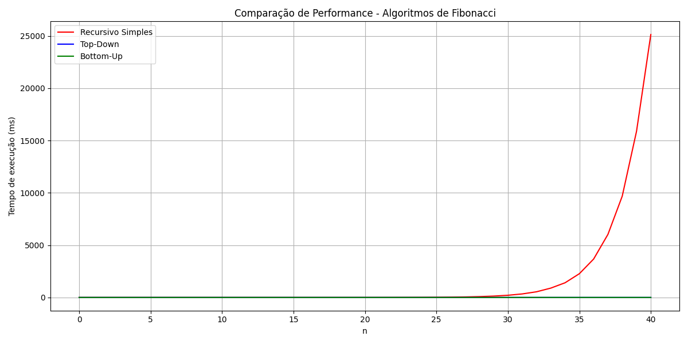
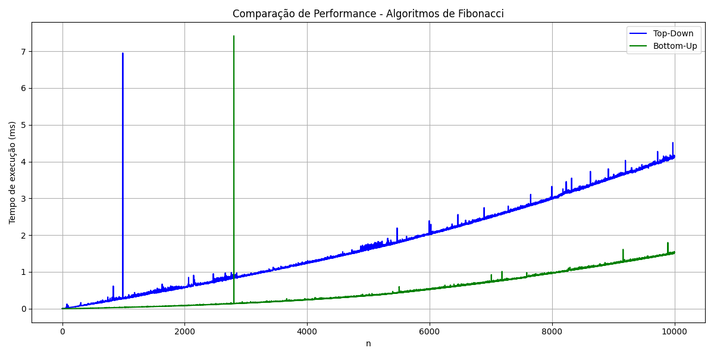

# Análise Comparativa de Algoritmos de Fibonacci: Recursão vs. Programação Dinâmica

### Autor: Vitor Moschetti
### Data: 26/04/2025

O gráfico apresentado mostra claramente a diferença de performance entre três implementações do algoritmo de Fibonacci:

1. Recursivo Simples (vermelho): Apresenta crescimento exponencial, tornando-se impraticável para valores maiores que 35-40.
2. Top-Down (azul): Implementação com programação dinâmica que utiliza memorização.
3. Bottom-Up (verde): Implementação iterativa com programação dinâmica.

## O que é Programação Dinâmica?

A programação dinâmica é uma técnica que resolve problemas complexos dividindo-os em subproblemas mais simples e armazenando os resultados para evitar recálculos.
Isso é especialmente útil quando temos:

- Sobreposição de subproblemas: O mesmo cálculo é feito repetidamente
- Subestrutura ótima: A solução ótima do problema contém soluções ótimas dos subproblemas

## Abordagens da Programação Dinâmica

### Top-Down (Memorização)

- Mantém a estrutura recursiva do problema
- Armazena resultados em uma tabela/array para evitar recálculos
- Complexidade de tempo: O(n)
- Complexidade de espaço: O(n)

### Bottom-Up (Tabulação)

- Abordagem iterativa que constrói a solução de baixo para cima
- Evita a sobrecarga de chamadas recursivas
- Complexidade de tempo: O(n)
- Complexidade de espaço: O(n) - pode ser otimizada para O(1)

## Análise de Desempenho

Como podemos ver no primeiro gráfico, o algoritmo recursivo simples possui complexidade de tempo O(2^n), apresentando crescimento exponencial devastador após n = 30.
No segundo gráfico, focamos nas abordagens de programação dinâmica em escalas maiores (até n = 10.000), onde fica evidente que:

- O Bottom-Up é consistentemente mais rápido que o Top-Down
- Ambos têm crescimento linear (O(n)), mas o Bottom-Up tem menos overhead

## Benefícios da Programação Dinâmica

1. Eficiência: Redução drástica da complexidade de tempo em problemas com subproblemas sobrepostos.
2. Escalabilidade: Possibilidade de resolver problemas com entradas muito maiores.
3. Previsibilidade: Tempo de execução previsível e consistente.

Esta análise demonstra por que a programação dinâmica é uma técnica fundamental em algoritmos e estruturas de dados, 
transformando soluções exponenciais impraticáveis em algoritmos lineares eficientes.

#ProgramaçãoDinâmica #Algoritmos #Fibonacci #ComputaçãoEficiente #MemoriaVsTempoDeExecução

